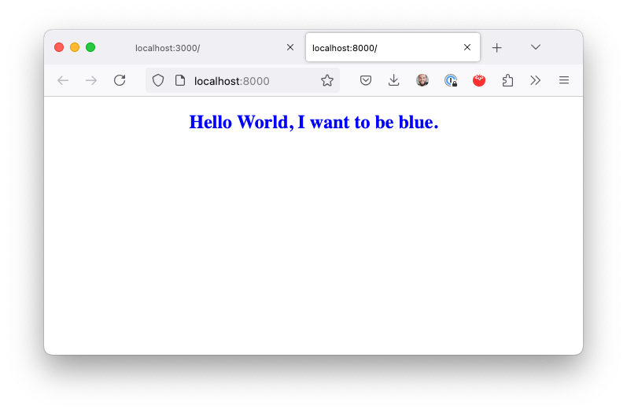
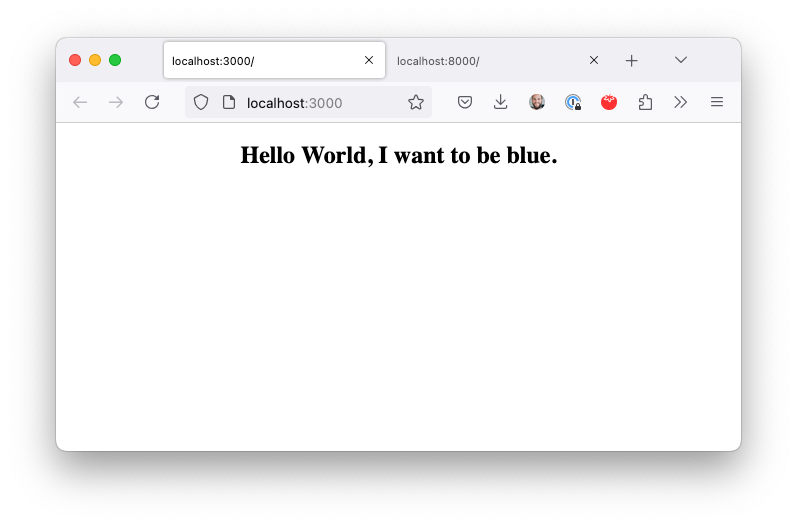

# CSS Order issue

This repo is a minimal example of a CSS order issue I'm facing with GatbsyJS.

If you run `npm run start` you will see this:

If you run `npm run build && npx serve public` you will see this instead:

